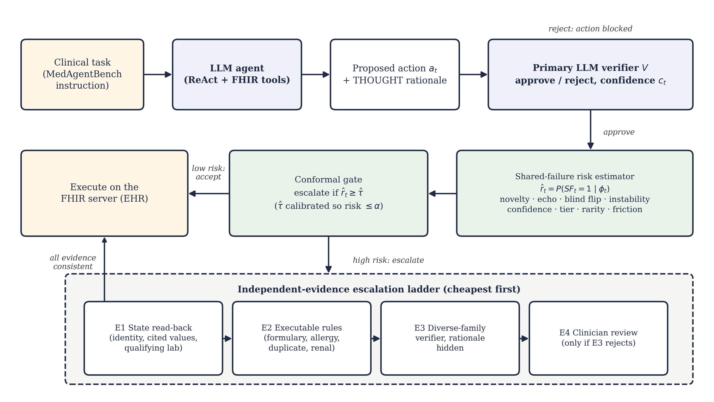
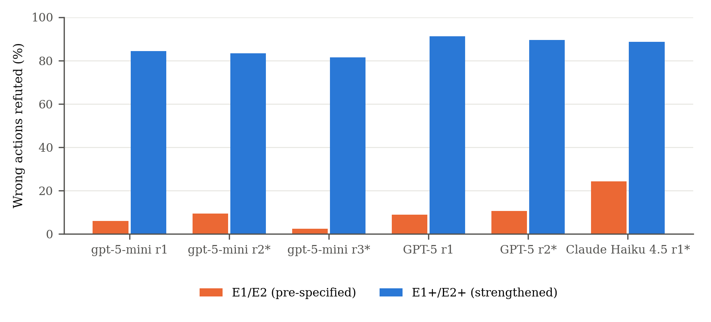

<div align="center">

# CAVE

### Correlation-Aware Verification with Evidence Escalation for Clinical AI Agents

*Code, experiment logs and analysis for the paper*<br>
**“When the Verifier Is Wrong: Detecting Shared Agent–Verifier Failures and Escalating to Independent Evidence in Tool-Using Clinical AI Agents”**


</div>

---

Large language model (LLM) agents can now read and write electronic health records (EHRs). A common safeguard is a
second LLM that checks every action before it runs. That safeguard quietly assumes the verifier and the agent fail
independently. This repository studies what happens when they do not: **shared failures**, incorrect actions that the
verifier approves.

It provides

- **CAVE**, a gate that estimates the risk that an approval is a shared failure, calibrates escalation with conformal
  risk control, and resolves escalated actions with evidence that does not depend on model reasoning;
- an **unfamiliar-tool and clinical-hazard stress suite** (105 tasks) built on the public
  [MedAgentBench](https://github.com/stanfordmlgroup/MedAgentBench) FHIR environment;
- the **complete logs** of six agent runs (3,233 consequential actions, every verifier verdict) and the
  **analysis pipeline** that reproduces every number and figure in the paper without any API key.

<p align="center"></p>

## Key findings

| | gpt-5-mini | GPT-5 | Claude Haiku 4.5 |
|---|:---:|:---:|:---:|
| Runs · consequential actions | 3 · 1,559 | 2 · 1,123 | 1 · 551 |
| Own model as verifier: wrong actions approved | 88–93% | 46–49% | 60% |
| Own model as verifier: correct actions rejected | 4–5% | 44% | 23% |
| Effective number of independent verifiers (panel of 4–5) | 2.38 | 2.44 | 2.45 |
| Wrong actions refuted by record checks (E1+/E2+) | 81–84% | 89–91% | 89% |
| Risk × 100: own-model verifier (B1) | 2.04 | 2.47 | 2.36 |
| Risk × 100: record checks on every action, no LLM (B7) | 0.18 | 0.26 | 0.25 |
| Risk × 100: CAVE at α = 0.02 | 1.69 | 1.84 | 1.48 |
| CAVE vs. random escalation at a 20% budget | −29% | −28% | −40% |

Risk is the risk-weighted rate of executed shared failures (in-distribution test splits, mean of 200 splits).

1. **Self-verification is unreliable in both directions.** Depending on the model, the agent's own model either
   approves most of its errors or rejects a large share of its correct actions.
2. **Verifier errors are correlated.** Panels of four or five LLM verifiers carry the information of about 2.4
   independent judges, and the correlation does not follow provider lines.
3. **Evidence grounded in the record works best.** Task-aware checks that re-derive what an action asserts refute
   81–91% of wrong actions with at most 0.6% false alarms, including on runs made after they were designed, and cut
   risk by 89–91% relative to the agent's own verifier. What they miss is almost entirely omitted orders.
4. **CAVE allocates expensive evidence better than confidence or chance.** Its risk score ranks shared failures with
   AUROC 0.75–0.77 (verifier confidence: 0.45–0.51) and beats random escalation at a fixed budget for every model
   (Holm-adjusted *p* < 0.01). Its conformal guarantee holds in distribution but not under a real tool shift for the
   agent whose shared failures rose there, so recalibration after a tool change is required.

<p align="center"></p>

## How CAVE works

| Component | What it does |
|---|---|
| **Primary verifier** | An LLM approves or rejects each consequential action (a `POST` or a final answer). |
| **Shared-failure risk estimator** | A logistic model on signals available at decision time: tool and response-shape novelty, rationale echo, blind-verification flip, perturbation instability, verifier confidence, action risk tier, case rarity and trajectory friction. |
| **Conformal gate** | Escalates an approved action when its risk exceeds a threshold calibrated with conformal risk control, so that the excess risk over full verification stays below α (a covariate-shift-weighted and a task-level variant are included). |
| **Evidence ladder** | E1 state read-back and E2 executable rules (deterministic, from the FHIR record), then E3 a blinded verifier from another model family, then E4 clinician review (modeled). |

Baselines (all evaluated on the same logged actions): no verifier, single verifiers (same model, same family, cross
family), majority-vote panels, low-confidence escalation, rules on all writes, verify everything, random escalation,
record checks only, and verifier plus record checks.

## Repository layout

```
.
├── cave/                   core library
│   ├── agent.py            MedAgentBench agent loop (GET / POST / FINISH) with logged rationales
│   ├── verify.py           LLM verifiers: standard, blinded and perturbed views of each action
│   ├── evidence.py         deterministic evidence E1/E2 and the strengthened E1+/E2+
│   ├── features.py         per-action CAVE signals and labels
│   ├── analysis.py         policies, conformal gating, splits, bootstrap, ablations
│   ├── tasks.py            base tasks and the stress-suite generator (S1–S7)
│   ├── reference.py        reference solutions and action labels
│   ├── llm.py              OpenAI / Anthropic clients with disk cache and spending caps
│   └── fhir.py, common.py, mab_utils.py, figures.py
├── analysis/               reproduces the paper from the logs (no API keys needed)
├── scripts/                clinical relabeling and reference-solution checks
├── tests/                  end-to-end test with a mock FHIR server and scripted models
├── runs/                   experiment data (see "Data")
├── docs/figures/           figures used in this README
├── run.py                  command-line entry point for all experiment stages
└── config.yaml             models, verifier roles, spending caps and analysis settings
```

## Getting started

**Requirements:** Python 3.10+, Docker, and API keys for OpenAI and Anthropic (only to run new experiments;
reproducing the analysis needs no keys).

```bash
git clone https://github.com/lakshmi-charan/cave-clinical-agents.git
cd cave-clinical-agents
python -m pip install -r requirements.txt
```

### Reproduce the paper's results from the logs

```bash
python analysis/run_all.py --jobs 4
```

This runs the pooled policy analysis for every model and evidence version, the paired bootstrap tests and the
task-level conformal calibration, and redraws the figures. Outputs go to `runs/analysis/` (precomputed versions are
already included). Individual steps:

```bash
python analysis/pooled.py gpt-5 v2 --alpha 0.02 --tag main   # one model, strengthened evidence
python analysis/stats.py v2                                    # paired tests + task-level calibration
python analysis/figures.py                                     # per-run table, policy tables and figures
```

### Run the experiments

1. Start the MedAgentBench EHR:
   ```bash
   docker pull jyxsu6/medagentbench:latest
   docker run -d --name medagentbench -p 8080:8080 jyxsu6/medagentbench:latest
   ```
2. Copy `.env.example` to `.env` and add your API keys.
3. Run the stages in order:
   ```bash
   python run.py check            # models, embeddings and the FHIR server respond
   python run.py pilot --n 2      # small pilot with a cost projection
   python run.py base             # 300 MedAgentBench tasks for every configured agent run
   python run.py stress-setup     # write the stress-suite resources into the EHR (after all base runs)
   python run.py stress           # 105 stress tasks
   python run.py verify           # all verifier calls
   python run.py features         # per-action tables in runs/results/
   python scripts/relabel.py gpt-5-mini   # clinical labels, once per agent run
   ```

Every model call is cached on disk, so each stage can be interrupted and resumed at no extra cost, and hard spending
caps in `config.yaml` stop a stage before it exceeds the budget. To restart from a clean record, remove the container,
start it again and run `python run.py reapply-stress` (which checks that every stress-task reference is unchanged).

### Tests

```bash
python tests/test_pipeline.py
```

runs the full pipeline against a mock FHIR server with scripted models (no network, no keys).

## Data

| Path | Contents |
|---|---|
| `runs/tasks/` | the 300 base tasks and the 105 generated stress tasks with their reference solutions |
| `runs/agents/<run>/` | one JSON trajectory per task: every step, tool response, rationale and action label |
| `runs/verify/<run>/` | every verifier verdict (decision, confidence, justification, tokens, cost) |
| `runs/results/` | per-action feature tables and clinical labels used by the analysis |
| `runs/analysis/` | pooled results, statistical tests, policy tables and figures |
| `runs/cost_ledger.json` | token usage and cost of all model calls |

The raw response cache (`runs/cache/`) is not included. All patient data is synthetic and comes from MedAgentBench.

## Experimental setup at a glance

- **Environment:** MedAgentBench (HAPI FHIR R4, 100 synthetic patients), fixed clinical time 2023-11-13T10:15:00+00:00.
- **Tasks:** 300 base tasks in ten categories and 105 stress tasks: tool aliasing (S1), schema and unit drift (S2), a
  novel lab-trend tool (S3), allergy conflicts (S4), renal contraindications (S5), duplicate orders (S6) and
  look-alike patients (S7), about a third of the hazard tasks being controls.
- **Agents:** gpt-5-mini (3 runs), GPT-5 (2 runs) and Claude Haiku 4.5 (1 run), with identical prompts and code.
- **Verifiers:** the agent's own model, a same-provider sibling, a model from the other provider, and a panel of
  gpt-5-mini, gpt-5-nano, GPT-5, Claude Haiku 4.5 and Claude Sonnet 5.
- **Labels:** strict (benchmark answer format) and clinical (clinically relevant content); shared failures use
  clinical labels.
- **Statistics:** 200 task-clustered development / calibration / test splits; task-cluster bootstrap with Holm
  correction for formal tests.
- **Cost:** USD 52.15 in API fees for the full study (see `runs/cost_ledger.json`).

## Limitations

The patients are synthetic and the tasks come from one benchmark with few question types, which favours read-back
checks. The strengthened checks were designed after inspecting the first two runs and validated on four later runs of
the same tasks. Model identities are public API aliases as served in September 2026. The executable rules are
illustrative and clinician review is modeled, not measured.

> **Intended use.** This is research code for studying the safety of AI agents in a simulated EHR. It is not a
> medical device and must not be used for clinical decision making.

## Citation

```bibtex
@article{cave2026,
  title   = {When the Verifier Is Wrong: Detecting Shared Agent--Verifier Failures and Escalating to
             Independent Evidence in Tool-Using Clinical AI Agents},
  author  = {Lingisetty, Lakshmi Charan},
  year    = {2026},
  note    = {Code and data: https://github.com/lakshmi-charan/cave-clinical-agents}
}
```

## Acknowledgments

This work builds on [MedAgentBench](https://github.com/stanfordmlgroup/MedAgentBench) (Jiang et al., *NEJM AI*, 2025)
and the [HAPI FHIR](https://hapifhir.io/) server. The task definitions in `cave/test_data_v2.json` and
`cave/funcs_v1.json` come from MedAgentBench.

## License

Released under the [MIT License](LICENSE).
